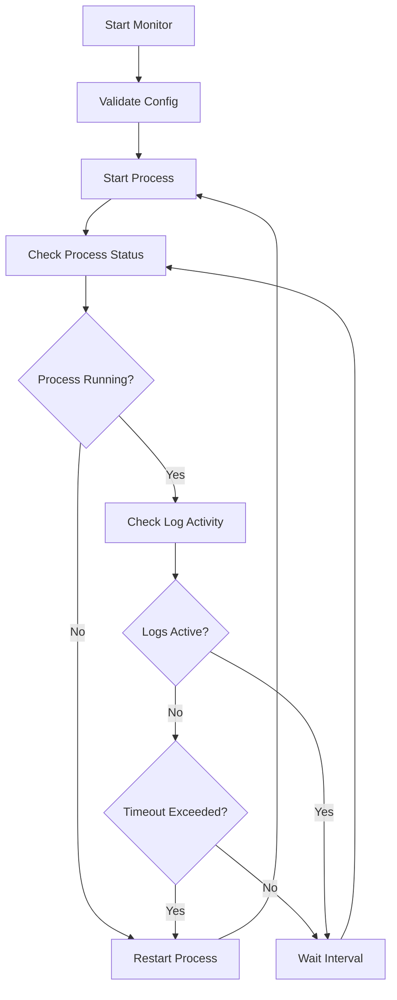

# Monitor Procesów - Dokumentacja

## Spis treści
- [Opis](#opis)
- [Funkcjonalności](#funkcjonalności)
- [Instalacja](#instalacja)
- [Użycie](#użycie)
- [Parametry](#parametry)
- [Przykłady](#przykłady)
- [Architektura](#architektura)
- [API Reference](#api-reference)
- [Troubleshooting](#troubleshooting)
- [FAQ](#faq)

## Opis

Monitor Procesów to narzędzie napisane w Go, które automatycznie monitoruje działanie procesów poprzez analizę ich plików logów. Gdy proces przestaje generować logi przez określony czas lub całkowicie przestaje działać, monitor automatycznie go restartuje.

### Główne zastosowania:
- Monitorowanie aplikacji serwerowych
- Automatyczny restart zawieszonych procesów
- Nadzór nad długotrwałymi zadaniami batch
- Monitoring skryptów i narzędzi CLI

## Funkcjonalności

✅ **Automatyczny restart** - Process jest restartowany gdy przestaje działać lub generować logi  
✅ **Monitoring plików logów** - Analizuje rozmiar i czas modyfikacji plików  
✅ **Graceful shutdown** - Proces jest najpierw zamykany sygnałem SIGTERM, następnie SIGKILL  
✅ **Bezpieczność wątków** - Pełna synchronizacja z mutex  
✅ **Context-aware** - Używa Go context dla lepszej kontroli  
✅ **Konfigurowalne timeouty** - Możliwość ustawienia własnych czasów oczekiwania  
✅ **Szczegółowe logi** - Informacje o statusie i działaniach monitora  
✅ **Obsługa sygnałów** - Graceful shutdown przy Ctrl+C lub kill  

## Instalacja

### Kompilacja ze źródeł

```bash
# Klonowanie/pobieranie kodu
git clone <repository-url>
cd process-monitor

# Kompilacja
go build -o monitor main.go

# Opcjonalnie - instalacja globalna
sudo cp monitor /usr/local/bin/
```

### Wymagania systemowe

- Go 1.16 lub nowszy
- System operacyjny: Linux, macOS, Windows (z WSL)
- Uprawnienia do uruchamiania procesów i tworzenia plików

## Użycie

### Podstawowa składnia

```bash
./monitor <komenda> <plik_logów> [timeout_sek] [interwał_sek]
```

### Parametry obowiązkowe

| Parametr | Opis |
|----------|------|
| `komenda` | Aplikacja do monitorowania (w cudzysłowach) |
| `plik_logów` | Ścieżka do pliku z logami procesu |

### Parametry opcjonalne

| Parametr | Domyślna wartość | Opis |
|----------|------------------|------|
| `timeout_sek` | 60 | Czas w sekundach po którym proces zostanie zrestartowany przy braku zmian w logach |
| `interwał_sek` | 5 | Częstotliwość sprawdzania stanu procesu (w sekundach) |

## Przykłady

### Podstawowe użycie

```bash
# Monitorowanie aplikacji Python
./monitor "python3 app.py > /tmp/app.log 2>&1" "/tmp/app.log"

# Monitorowanie aplikacji Java z większym timeoutem
./monitor "java -jar myapp.jar" "/var/log/myapp.log" 120 10

# Monitorowanie skryptu bash
./monitor "./backup-script.sh" "/tmp/backup.log" 30 3
```

### Zaawansowane przykłady

```bash
# Aplikacja z przekierowaniem błędów
./monitor "node server.js 2>&1 | tee /var/log/node.log" "/var/log/node.log"

# Długotrwałe zadanie z rzadkimi logami
./monitor "python3 data-processor.py" "/var/log/processor.log" 300 30

# Monitor z bardzo częstym sprawdzaniem
./monitor "realtime-app" "/tmp/realtime.log" 10 1
```

### Użycie jako systemd service

```ini
# /etc/systemd/system/myapp-monitor.service
[Unit]
Description=Monitor dla MyApp
After=network.target

[Service]
Type=simple
User=myuser
WorkingDirectory=/opt/myapp
ExecStart=/usr/local/bin/monitor "python3 app.py > /var/log/myapp.log 2>&1" "/var/log/myapp.log" 60 5
Restart=always
RestartSec=10

[Install]
WantedBy=multi-user.target
```

## Architektura

### Główne komponenty

```
┌─────────────────┐
│     Monitor     │
├─────────────────┤
│ • Configuration │
│ • Process Mgmt  │
│ • Log Checking  │
│ • Signal Handler│
└─────────────────┘
        │
        ├── Process ──────► Monitorowany proces
        │
        ├── Log File ─────► Plik z logami
        │
        └── Signals ──────► SIGTERM/SIGKILL
```

### Przepływ działania



### Synchronizacja i bezpieczeństwo

Monitor używa następujących mechanizmów synchronizacji:

- **RWMutex** - Chroni dostęp do struktury procesu
- **Context** - Kontroluje cykl życia procesów
- **Channels** - Komunikacja między goroutines
- **Select** - Non-blocking operacje na kanałach

## API Reference

### Struktura Monitor

```go
type Monitor struct {
    command     string        // Komenda do uruchomienia
    logFile     string        // Ścieżka do pliku logów
    timeout     time.Duration // Timeout bez zmian w logach
    interval    time.Duration // Interwał sprawdzania
    process     *exec.Cmd     // Wskaźnik do procesu
    lastModTime time.Time     // Ostatnia modyfikacja logów
    lastLogSize int64         // Ostatni rozmiar logów
    mutex       sync.RWMutex  // Mutex do synchronizacji
    ctx         context.Context
    cancel      context.CancelFunc
}
```

### Główne metody

#### NewMonitor(command, logFile string, timeout, interval int) *Monitor
Tworzy nową instancję monitora.

**Parametry:**
- `command` - komenda do wykonania
- `logFile` - ścieżka do pliku logów  
- `timeout` - timeout w sekundach
- `interval` - interwał sprawdzania w sekundach

**Zwraca:** Wskaźnik do nowej instancji Monitor

#### (m *Monitor) Run()
Uruchamia główną pętlę monitora. Metoda blokująca.

#### (m *Monitor) startProcess() error
Uruchamia nowy proces. Thread-safe.

**Zwraca:** Error w przypadku niepowodzenia

#### (m *Monitor) killProcess()
Zabija aktualny proces w sposób graceful (SIGTERM → SIGKILL). Thread-safe.

#### (m *Monitor) isProcessRunning() bool
Sprawdza czy proces nadal działa. Thread-safe.

**Zwraca:** true jeśli proces działa, false w przeciwnym przypadku

#### (m *Monitor) checkLogs() (bool, error)
Sprawdza aktywność w pliku logów.

**Zwraca:** 
- `bool` - true jeśli logi są aktywne lub nie przekroczono timeout
- `error` - błąd w przypadku problemów z dostępem do pliku

#### (m *Monitor) validate() error
Waliduje konfigurację i przygotowuje środowisko.

**Zwraca:** Error w przypadku niepowodzenia walidacji

### Przykład użycia API

```go
package main

import (
    "log"
    "time"
)

func main() {
    // Utworzenie monitora
    monitor := NewMonitor(
        "python3 myapp.py",
        "/var/log/myapp.log",
        60,  // timeout
        5,   // interval
    )
    
    // Uruchomienie (blokujące)
    monitor.Run()
}
```

## Troubleshooting

### Najczęstsze problemy

#### Monitor się nie uruchamia

```bash
# Sprawdź uprawnienia
ls -la /path/to/logfile
chmod 644 /path/to/logfile

# Sprawdź czy katalog istnieje
mkdir -p /path/to/logs/

# Sprawdź składnię komendy
./monitor "echo test" "/tmp/test.log"
```

#### Proces jest restartowany zbyt często

```bash
# Zwiększ timeout
./monitor "my-command" "/var/log/app.log" 120 10

# Sprawdź czy aplikacja rzeczywiście pisze do logów
tail -f /var/log/app.log

# Sprawdź czy ścieżka do logów jest poprawna
./monitor "my-command > /tmp/debug.log 2>&1" "/tmp/debug.log"
```

#### Monitor nie wykrywa zmian w logach

```bash
# Sprawdź czy plik logów rośnie
watch -n 1 "ls -la /var/log/app.log"

# Sprawdź uprawnienia zapisu
touch /var/log/app.log
echo "test" >> /var/log/app.log

# Sprawdź czy aplikacja pisze do tego samego pliku
lsof | grep /var/log/app.log
```

### Debug mode

Dla debugowania możesz dodać dodatkowe logi:

```bash
# Uruchom z przekierowaniem debug info
./monitor "my-command" "/var/log/app.log" 2>&1 | tee /tmp/monitor-debug.log

# Sprawdź logi systemowe
journalctl -f | grep monitor
```

### Znane ograniczenia

1. **Symlinki** - Monitor może mieć problemy z symlinkami do plików logów
2. **Rotacja logów** - Przy rotacji logów może być potrzebny restart monitora
3. **NFS/Network drives** - Może być opóźnienie w wykrywaniu zmian
4. **Bardzo duże pliki** - `os.Stat()` może być wolny dla bardzo dużych plików

